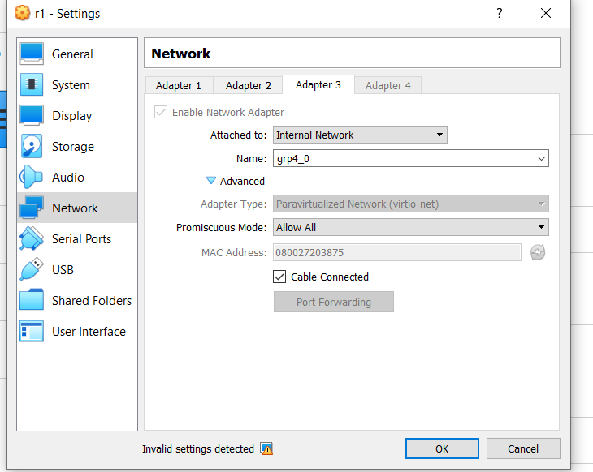
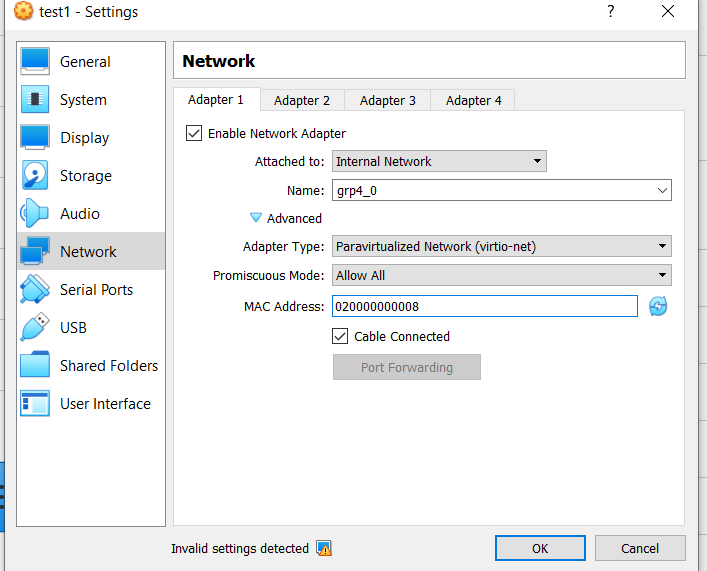
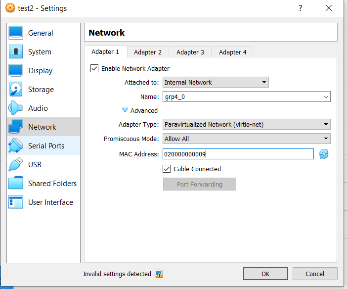
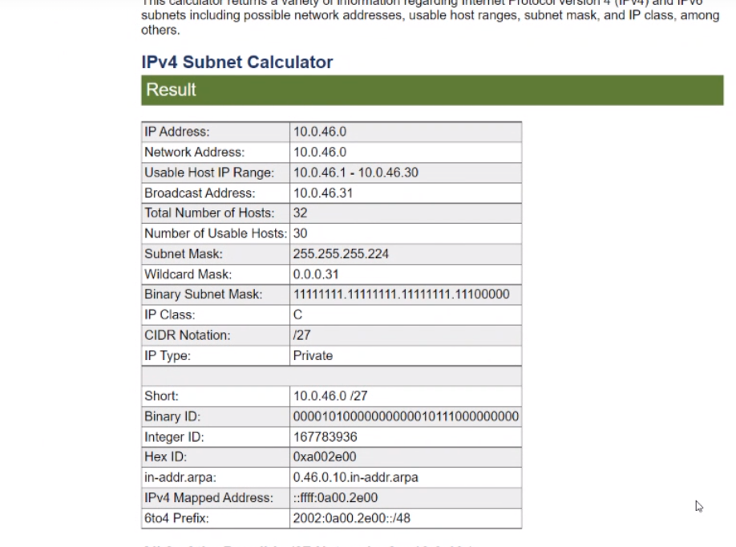
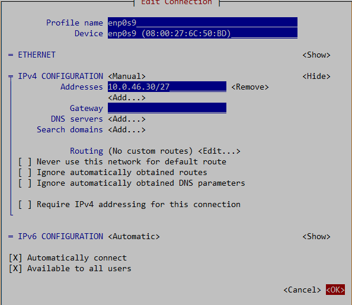
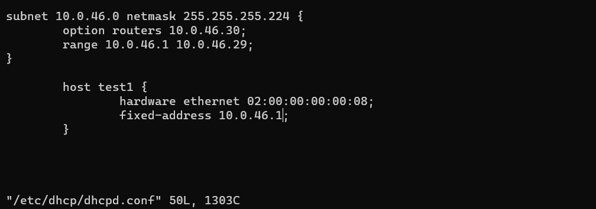
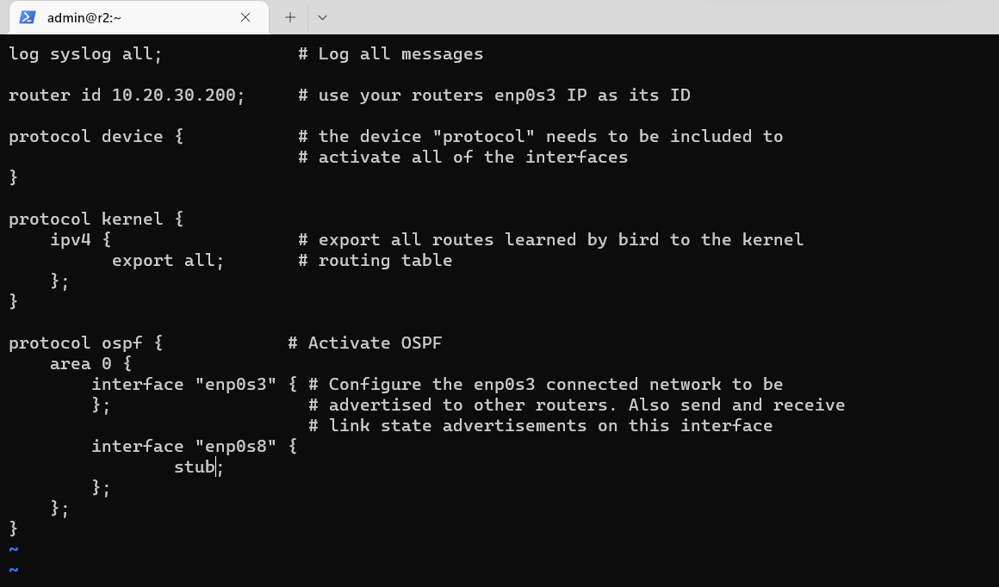
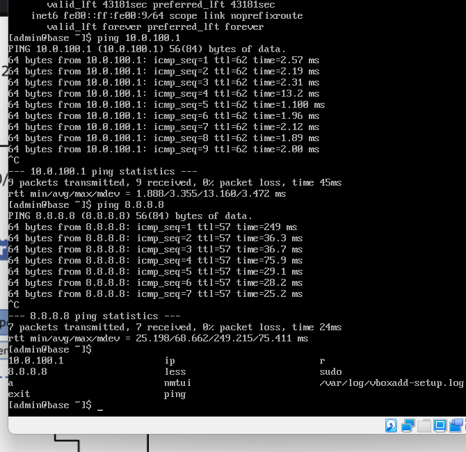
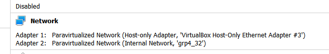
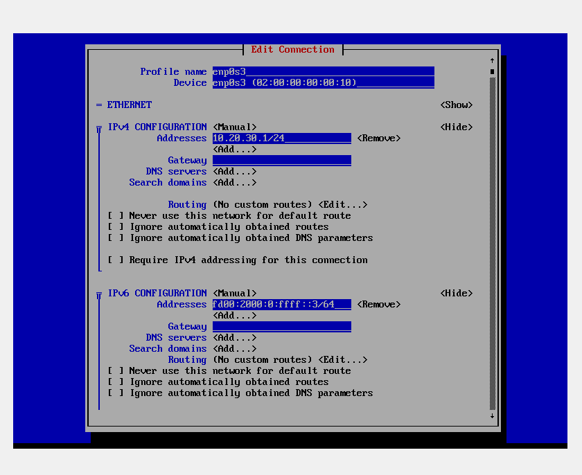

# Net Configuration for Enterprise Networking Final
## Part A

Step 1. Make sure r2 is powered off.
- go into settings for r1, go into network, go to adapter 3, enable it, choose internal network, name it "grp4_0" (whatever he has on his sheet).
- click advanced, under adapter type: choose paravirtualized Network, choose allow all for promiscuous mode, MAC address can stay whatever you currently have

Step 2. Clone test1 and test2 from Centos_8_base
- make sure it's create new MAC addresses, press next and choose linked clone. 

Step 3. Change network settings for test1 and test 2
- choose internal network
- name grp4_0 (once again, whatever name he specifies)
- select "allow all" in promiscuous mode
- set MAC address to 02000008 and 9, if its available, aka something easy to remember



- Turn on all VMs

Step 4. The network should be configured with the following IP range: 10.046.0/27 (for the final, use whatever he has in the question)
- use google subnet calculator to find the subnet mask, range, etc.



- Open r2 and login

- you can use ssh r2 to connect to it using powershell

```
sudo nmtui
```
Edit the wired connection: 
- change the profile name to whatever the he wants
- change ipv4 to manual and click show
- google subnet calculator 
- input the given IP range, and use either the maximum or minimum ip range given.
- input the Address as either the max or minimum usable host ip range
- no routing, no gateway, press okay



while still in r2: 

- given the address the 10.0.46.0, 


```
sudo vim /etc/dhcp/dhcpd.conf

subnet 10.0.46.0 netmask 255.255.255.224 { #subnet mask number
    option routers 10.0.46.30 #this gives maximum range, needs to be the equivalent of what is  set in nmtui
    range 10.0.46.1 10.0.46.29; #min to max before 30, this line can support up to 29 addresses
}

    host test1 {
        hardware ethernet 02:00:00:00:00:08; #your mac address for test1
        fixed address 10.0.46.1; #assigned address
    }
}
    #:wq! to save and then exit
```

you get these numbers from the IP calculator. 

- next
```
sudo vim /etc/bird.conf
```


```
log syslog all;

router id 10.20.30.200;

protocol device{

}

protocol kernel {
    ipv4 {
        export all;
    };
}

protocol ospf {
    area 0 {
        interface "enp0s3" {
            };
        interface "enp0s8" {
                stub; #stub just means that the routing table ends here and doesnt need to be ended any further.
        }
        interface "enp0s9" {
                stub;
        };
    };
}
```

save 

```
sudo systemctl enable dhcpd
sudo systemctl start dhcpd
sudo systemctl enable bird
sudo systemctl start bird
sudo systemctl status dhcpd
sudo systemctl status bird

``` 
this tests if its working or not.

Step 5

use sudo reboot to reactivate r2

```
ping 10.0.100.1 -> pings web to see if it's online

```




## Part B

Step 1: clone centos_8_base again linked clone
- name it grp4_rtr (or whatever he says tmr)
- generate new mac addreses

Step 2: 
Adapter 1: para network, host-only 
Adapter 2 internal network adapter named grp4_32, paravirtualized network, allow all prom mode, mac address 0200000000011



Step 3: create test 3 and test 4, connect them to grp4_32 and make new mac addresses thats easy to remember

Step 4: within the grp4 router, sudo nmtui , edit system enp0s3: rename to enp0s3, make it manual, 



step 5: ip r (shows routes and what's connected to it), then ip a

step 6: sudo vim /etc/dhcp/dhcpd.conf 
- aka repeat everything from Part A.